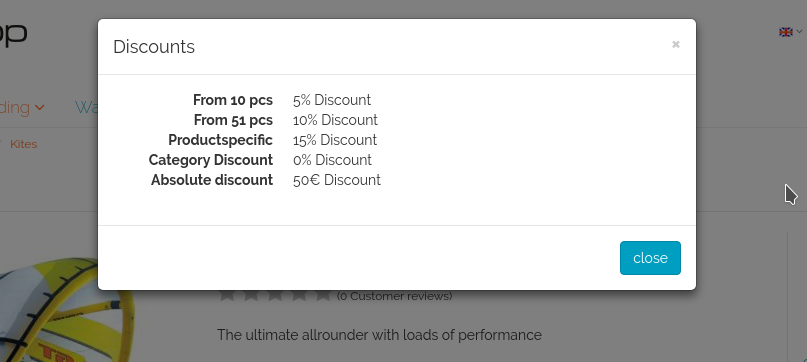

# PCSG - Product Discounts

## Description

This module displays the products discounts directly on the articles page.

## Features

* Renames the `Block price` button in the article page to `Discounts`
* Show all discounts that are available for the current user for the viewed article in the `Discounts` Window
* Each discount will get displayed with its name and the appropriate discount value as percentage or absolute number




## Requirements

This module was written for Oxid6 Community Edition.  
It should run on a fresh Oxid Installation.  

We can not guarantuee that the module is working properly on other oxid versions.

## Installation

The module can be installed via composer.  

**Step 1: Directory**  
Go to the root directory of oxid (the one that contains the `vendor` and the `source` folder).  

**Step 2: Composer**  
Execute the following composer command:

```
composer require "pcsg/oxid-products-discount" "^1.0"
```

This will download the module and install it into the correct directory.

**Step 3: Oxid**  
Activate the Module in your admin panel.


